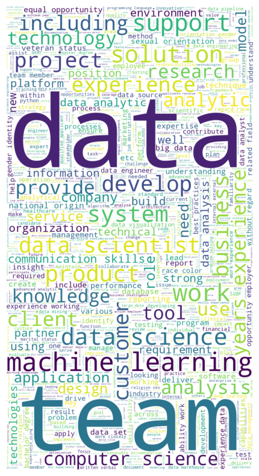

# Project_Regression_Data_Science_Salary
Collect, clean raw data from Internet and build models to predict data science average annual salary.

My model contain a tool that predict data science related job to help people have an understanding about this field and negotiate their income when it comes to interview.

First I scraped over 1000 job descriptions from glassdoor using python and selenium library then I do some Features Engineering with each columns of job description to determine the value companies put on diverse skills like python, excel, spark and aws. I also using 3 different models: Linear, Lasso and Random Forest Regressors using GridSearchCV to reach the best paramater for the model. Finally, I built a client facing API using flask to simulate interaction between a client and server in real-time.

# Installation


* Create a conda virtual environment and activate it:

```
conda create -n ds_salary python=3.7 -y
source activate ds_salary
```
* Then, install the following packages: pandas, numpy, sklearn, matplotlib, seaborn, selenium, flask, json, pickle

You can also install all the requirements packakes: ```pip install -r requirements.txt```  

# Usage

## Dataset Preparation

Scrape 1000 job postings from glassdoor.com. With each job, we got the following features:
*	Job title
*	Salary Estimate
*	Job Description
*	Rating
*	Company 
*	Location
*	Company Headquarters 
*	Company Size
*	Company Founded Date
*	Type of Ownership 
*	Industry
*	Sector
*	Revenue
*	Competitors

## Data Cleaning
After scraping the raw data,  its needed to be cleaned up so I can use for the model. I made the following changes and created the following variables:
*	Parsed numeric data out of salary 
*	Made columns for employer provided salary and hourly wages 
*	Removed rows without salary 
*	Parsed rating out of company text 
*	Made a new column for company state 
*	Added a column for if the job was at the company’s headquarters 
*	Transformed founded date into age of company 
*	Made columns for if different skills were listed in the job description:
    * Python  
    * R  
    * Excel  
    * AWS  
    * Spark 
*	Column for simplified job title and Seniority 
*	Column for description length 

## EDA
I looked at the distributions of the data and the value counts for the various categorical variables. Below are a few highlights from the pivot tables. 

<p align="center">
  
</p> 
<p align="center">
  
</p> 
<p align="center">
  
</p> 


## Model Building 

First, I transformed the categorical variables into dummy variables. I also split the data into train and tests sets with a test size of 20%.   

I've done expriments on three different models and evaluated them using Mean Absolute Error. MAE is chosen because it is relatively easy to interpret and outliers aren’t particularly bad in for this type of model.   

Three different models:
*	**Multiple Linear Regression** – Baseline for the model
*	**Lasso Regression** – Because of the sparse data from the many categorical variables, I thought a normalized regression like lasso would be effective.
*	**Random Forest** – Again, with the sparsity associated with the data, I thought that this would be a good fit. 

## Model performance
The Random Forest model far outperformed the other approaches on the test and validation sets. 
*	**Random Forest** : MAE = 11.22
*	**Linear Regression**: MAE = 18.86
*	**Ridge Regression**: MAE = 19.67

## Production Step
In this step, I also built a flask API endpoint that was hosted on a local webserver to simulate interaction between a client and server in real-time. The API endpoint takes in a request with a list of values from a job listing and returns an estimated salary. 

